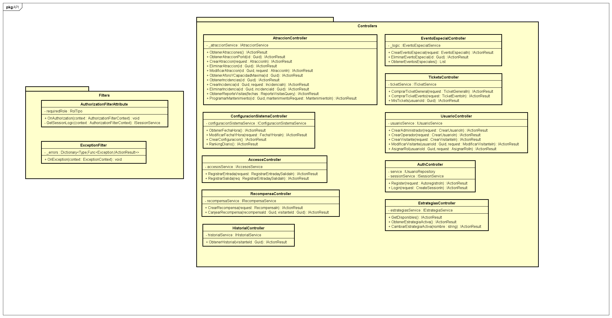

This diagram represents the API layer of the system, which exposes the application's functionality through REST controllers. Each controller handles HTTP requests related to a specific domain area, such as attractions, users, tickets, rewards, or events. The controllers delegate the business logic to the corresponding services and rely on filters for authorization and centralized exception handling, ensuring consistent request processing and security across the API.

