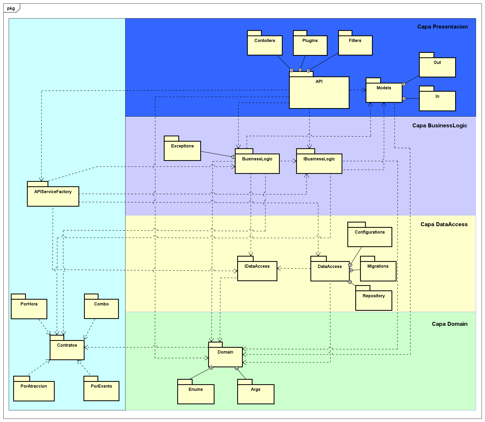

Architecture Overview
This project follows a layered architecture pattern organized into four distinct layers:

Presentation Layer: Handles HTTP entry points via Controllers, Plugins, and Filters feeding into an API package, alongside Models split into input/output contracts (In/Out).

Business Logic Layer: Contains the core application logic through BusinessLogic and its interface IBusinessLogic, with dedicated exception handling via an Exceptions package.

Data Access Layer: Abstracts persistence through IDataAccess and DataAccess, supported by Repository, Migrations, and Configurations packages following the Repository pattern.

Domain Layer: Defines the core entities, Enums, and Args shared across the application.

A separate Contracts module (left panel) defines service contracts for different pricing/event models (PorHora, PorAtraccion, PorEvento, Combo), consumed via an APIServiceFactory that bridges the contract layer with the main architecture.

