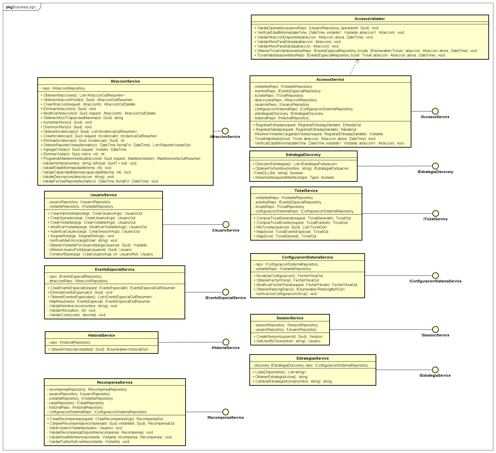

This diagram illustrates the business logic layer, which contains the core application services responsible for implementing the system's business rules. Each service coordinates domain operations and interacts with repositories to retrieve or persist data. Additional components, such as validators and strategy discovery mechanisms, support the application logic by enforcing domain constraints and enabling dynamic behavior based on configured strategies.

