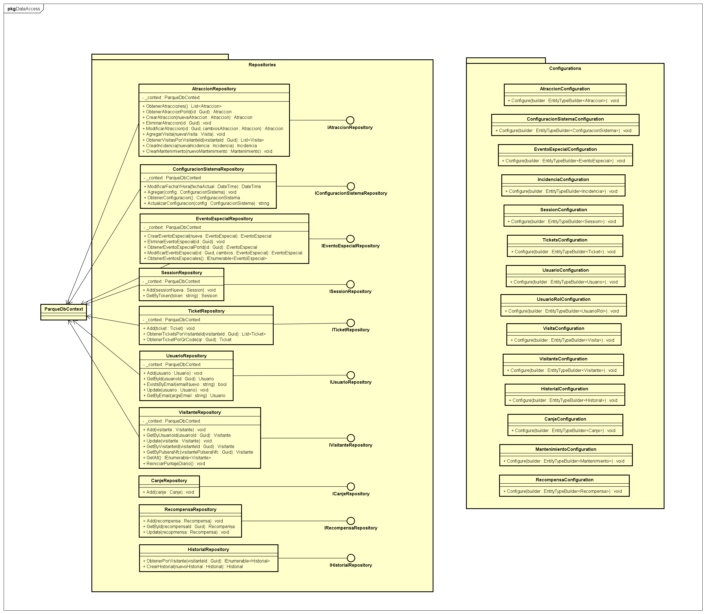

This diagram represents the data access layer responsible for persistence and interaction with the database. It includes repository implementations that encapsulate data access operations and Entity Framework configurations that define the mapping between domain entities and database tables. All repositories interact with a shared database context, ensuring a consistent and centralized approach to data management

