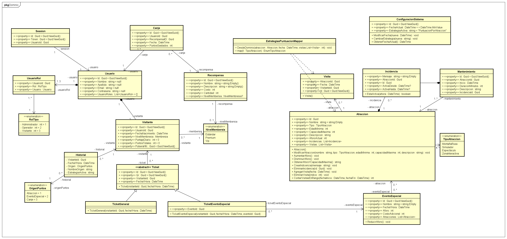

Domain model of a virtual theme park management system. It defines the main entities of the system such as users, visitors, attractions, visits, rewards, events, and maintenance operations. The model organizes the relationships between these entities and encapsulates the business logic required to manage attraction visits, reward redemption, point accumulation, and system configuration.

