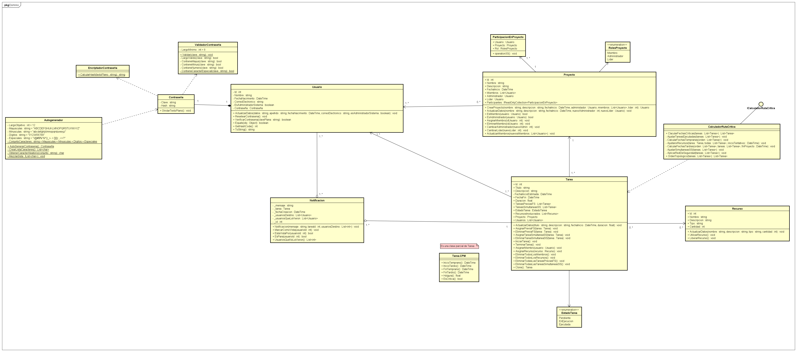

This diagram represents the domain model of the system, defining the core entities and their relationships within the project management context. The model includes key concepts such as users, projects, tasks, resources, and notifications. It also incorporates supporting components responsible for domain behaviors like password validation, task scheduling calculations, and resource management. The domain layer encapsulates the fundamental business concepts and rules of the system, providing the foundation upon which the application and infrastructure layers operate.

